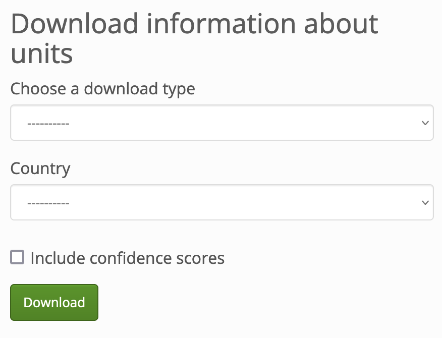
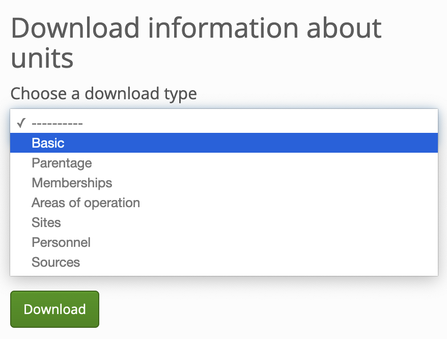
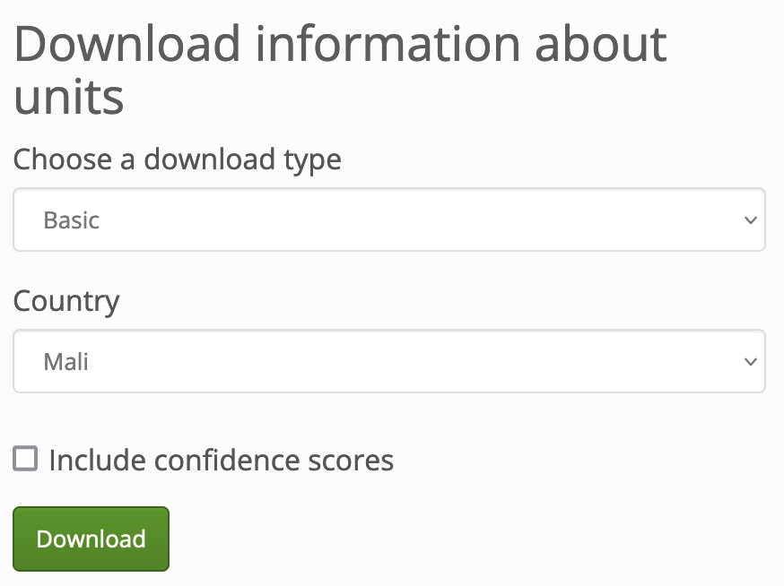

What data can I download from WhoWasInCommand?
==============================================

.. note ::

   May 2022: The WhoWasInCommand.com download feature is experimental and subject to change. Currently, the downloads do not reflect improvements in how the Security Force Monitor data model deals with Locations. 

Data for download
-----------------

Any data published on WhoWasInCommand can be downloaded as a set of Comma Separated Values (.csv) files. These can be easily loaded into a spreadsheet or database tool for analysis. To use WhoWasInCommand's data download feature visit the following link:

https://whowasincommand.com/en/download

The Security Force Monitor data model is a directed graph containing attriutes about units, persons, locations as they change across time. This is quite complicated and does not easily translate into a single file that is straightforward to understand and use without guidance. To get around this and provide a way to provide raw data directly to users, we offer seven different reports drawn from the data on a specific country:

-  **Basic**: a list of all the units in that country.
-  **Parentage**: units organized into a hierarchy.
-  **Memberships**: units that are part of operations that may fall outside the regular chain of command.
-  **Areas of operation**: geographical distribution of units' operational areas.
-  **Sites**: specific locations.
-  **Personnel**: list of command personnel.
-  **Sources**: sources used to evidence the data.

A full description of each downloadable slice of data is available in the sections below. It is important to note that none of the download contain the field-level sourcing that is a key part of Security Force Monitor's work (see the Research Handbook section on :ref:`Data integrity measures` for more information). The reason for this is technical (discussed `here <https://github.com/security-force-monitor/sfm-cms/issues/661#issuecomment-635450705>`__) on the code repository for the software that powers WhoWasInCommand.

How to download
---------------

Visit the download page: `https://whowasincommand.com/en/download <https://whowasincommand.com/en/download/>`__

The interface looks like this:

Use the dropdown menu to select the report that you want to download:

Then, use the next dropdown menu to choose the country about which you want to download data:

Optionally, tick the checkbox to include Confidence Scores in the downloaded report. Read the page on :ref:`Confidence scores` for more information about this data integrity measure. As mentioned above, downloads do not currently include field-level sourcing.

Finally, click "Download" and a file containing the report will be downloaded to your computer. To help you identify the report, its filename is created using this simple template: ``[report_type]_[country]_[YYYY-MM-DD].csv"``

Contents of each download
-------------------------

In this section we outline the seven different slices of data that users can download from WhoWasInCommand.com.

Download: Basic
^^^^^^^^^^^^^^^

**Description**

The "Basic" download contains a list of distinct units in the dataset, along with force branch, aliases, earliest and latest observation dates for each unit.

**Fields**

-  unit:id:admin
-  unit:name
-  unit:country
-  unit:classification
-  unit:other_names
-  unit:first_cited_date
-  unit:last_cited_date
-  unit:first_cited_date_start
-  unit:last_cited_date_open

Download: Parentage
^^^^^^^^^^^^^^^^^^^

**Description**

The "Parentage" download contains data that describes how units fit into the organizational structure of the security and defence forces of the specified country. Each row contains a child-parent (``unit:name`` - ``unit:related_unit``) relationship inside the orgaizational hierarchy. Each row also contains data on the timescale for each relationship. You can find more information about how relatioships between units work in the :ref:`Unit: Related Unit` section of this handbook.

**Fields**

-  unit:id:admin
-  unit:name
-  unit:country
-  unit:classification
-  unit:other_names
-  unit:first_cited_date
-  unit:last_cited_date
-  unit:first_cited_date_start
-  unit:last_cited_date_open
-  unit:related_unit
-  unit:related_unit:name
-  unit:related_unit:country
-  unit:related_unit_class
-  unit:related_unit_first_cited_date
-  unit:related_unit_first_cited_date_start
-  unit:related_unit_last_cited_date
-  unit:related_unit_open

Download: Memberships
^^^^^^^^^^^^^^^^^^^^^

**Description**

The "Memberships" download contains data showing that the unit has been attached to internal/national joint operations, international peacekeeping operations, or other multi-unit efforts. These operational unit groupings exist in parallel to units' positionings in the regular organizational structure as described in the "Parentage" download. You can find more information about how memberships work in the :ref:`Unit: Related Unit` section of this handbook.

**Fields**

-  unit:id:admin
-  unit:name
-  unit:country
-  unit:classification
-  unit:other_names
-  unit:first_cited_date
-  unit:last_cited_date
-  unit:first_cited_date_start
-  unit:last_cited_date_open
-  unit:membership_id
-  unit:related_unit
-  unit:member_country
-  unit:member_classification
-  unit:related_unit_first_cited_date
-  unit:related_unit_first_cited_date_start
-  unit:related_unit_last_cited_date
-  unit:related_unit_open

Download: Areas of operation
^^^^^^^^^^^^^^^^^^^^^^^^^^^^

**Description**

The "Areas of operation" download describes the geographical areas that units have either been assigned to or in which they have been observed operating within. The Research Handbook sections :ref:`Unit: Location Type`, :ref:`Unit: Location` and :ref:`Locations` describe the concept of an area of operation in more detail.

**Fields**

-  unit:id:admin
-  unit:name
-  unit:country
-  unit:classification
-  unit:other_names
-  unit:first_cited_date
-  unit:last_cited_date
-  unit:first_cited_date_start
-  unit:last_cited_date_open
-  unit:area_ops_id
-  unit:area_ops_name
-  unit:area_ops_country
-  unit:area_ops_feature_type
-  unit:area_ops_admin_level
-  unit:area_ops_admin_level_1_id
-  unit:area_ops_admin_level_1_name
-  unit:area_ops_admin_level_2_id
-  unit:area_ops_admin_level_2_name

Download: Sites
^^^^^^^^^^^^^^^

**Description**

The "Sites" download describes the specific locations at which specific units have been observed. This download covers locations like infrastructure (such as police stations, barracks, airfields) and specific settlements. The Research Handbook sections :ref:`Unit: Location Type`, :ref:`Unit: Location` and :ref:`Locations` describe the concept of site in more detail.

**Fields**

-  unit:id:admin
-  unit:name
-  unit:country
-  unit:classification
-  unit:other_names
-  unit:first_cited_date
-  unit:last_cited_date
-  unit:first_cited_date_start
-  unit:last_cited_date_open
-  unit:site_exact_location_id_latitude
-  unit:site_exact_location_name_longitude
-  unit:site_country
-  unit:site_feature_type
-  unit:site_admin_level
-  unit:site_nearest_settlement_id
-  unit:site_nearest_settlement_name
-  unit:site_first_admin_area_id
-  unit:site_first_admin_area_name

Download: Personnel
^^^^^^^^^^^^^^^^^^^

**Description**

The "Personnel" download provides data on people holding command positions in specific units. The download is organized by the unit to which a person was posted. It contains data on the person's posting (such as their role, rank, and title) in addition to any further biographical information (social media accounts, imagery of them, and so on). More information about how Security Force Monitor records data about persons is in the Research Handbook sections on :ref:`Persons` and :ref:`Persons Extra`.

**Fields**

-  unit:id:admin
-  unit:name
-  unit:country
-  unit:classification
-  unit:other_names
-  unit:first_cited_date
-  unit:last_cited_date
-  unit:first_cited_date_start
-  unit:last_cited_date_open
-  person:admin:id
-  person:name
-  person:other_names
-  person:country
-  person_extra:date_of_birth
-  person_extra:deceased_date
-  person_extra:deceased
-  person_extra:account_type
-  person_extra:account_id
-  person_extra:external_link_description
-  person_extra:media_desc
-  person_extra:notes:admin
-  person:posting_role
-  person:posting_rank
-  person:posting_title
-  person:posting_first_cited_date
-  person:posting_first_cited_date:year
-  person:posting_first_cited_date:month
-  person:posting_first_cited_date:day
-  person:posting_first_cited_date_start
-  person:posting_first_cited_date_start_context
-  person:posting_last_cited_date
-  person:posting_last_cited_date:year
-  person:posting_last_cited_date:month
-  person:posting_last_cited_date:day
-  person:posting_last_cited_date_end
-  person:posting_last_cited_date_end_context

Download: Sources
^^^^^^^^^^^^^^^^^

**Description**

The "Sources" download contains a list of all the sources used to evidence data on WhoWasInCommand. Unlike the other downloads, the content of the "Sources" download is not limited to a specific country: it's everything referenced anywhere in WhoWasInCommand. To learn more about how Security Force Monitor uses sources, visit the sections of the Research Handbook about :ref:`Data integrity measures` and :ref:`Sources`.

**Fields**

-  source:id:admin
-  source:title
-  source:type
-  source:author
-  source:publication_name
-  source:publication_country
-  source:published_timestamp
-  source:created_timestamp
-  source:uploaded_timestamp
-  source:url
-  source:access_point_id
-  source:access_point_type
-  source:access_point_trigger
-  source:accessed_timestamp
-  source:archive_url
