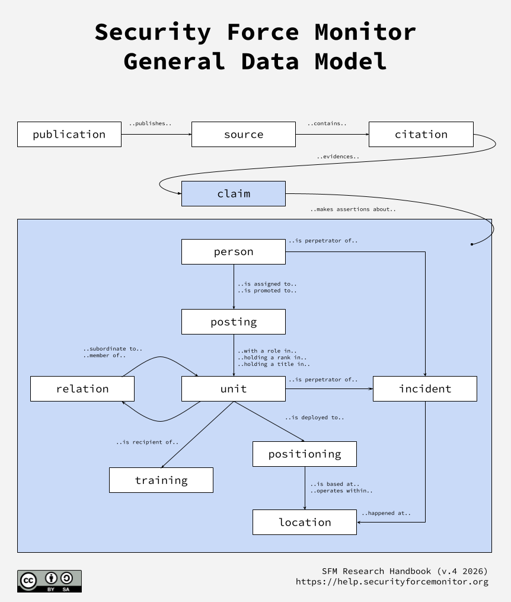

Our general data model
######################

Security Force Monitor investigates the conduct of security and defense forces around the world. We reconstruct their organizational structure, command personnel and chain of command, geographic footprint, and allegations of their involvement in committing human rights violations and violations of international criminal law. Further, we research the training and assistance that security and defense units have received from external security actors like the United States of America, the European Union, the United Nations, and through bilateral agreements with other states. All our information is drawn from publicly available sources, nearly all of which are online.

   
   ..

We use the general data model described in the above illustration to structure and organize the information we collect during the course of our research. It describes relationships between different "claims", which are logical groupings of data about a specific subject. For example, the "positioning" claim is where we store data about the geographic footprint of a unit, or the link between a unit and a location in time; cumulatively, all of the "positioning" claims describe the geographic presence of security forces across an entire country through time. 

Other sections of this Research Handbook expand on each of the claims and the relationships between these claims, including:

- A full description of each claim type;
- The overall data structure and attributes we use for each claim type;
- Examples on the types of data we enter into each attribute; and,
- Guidance on how we fill out each field and why.

The diagram above also highlights the special place that "citations" and "claims" hold in our research approach. Security Force Monitor uses a claim-based approach to the creation of data. A claim is an assertion of information evidenced by a citation from a source. Throughout our work, all specific pieces of information about any claim are kept together with the specific citation(s) from which they were drawn.

This approach enables complete transparency about the origins of data, and is a powerful data integrity measure. All the data that comprise each record about each claim type are drawn from an aggregation of claims.

Finally, the general data model guides the construction of the tools and technologies we have built to capture, store and analyze data.
